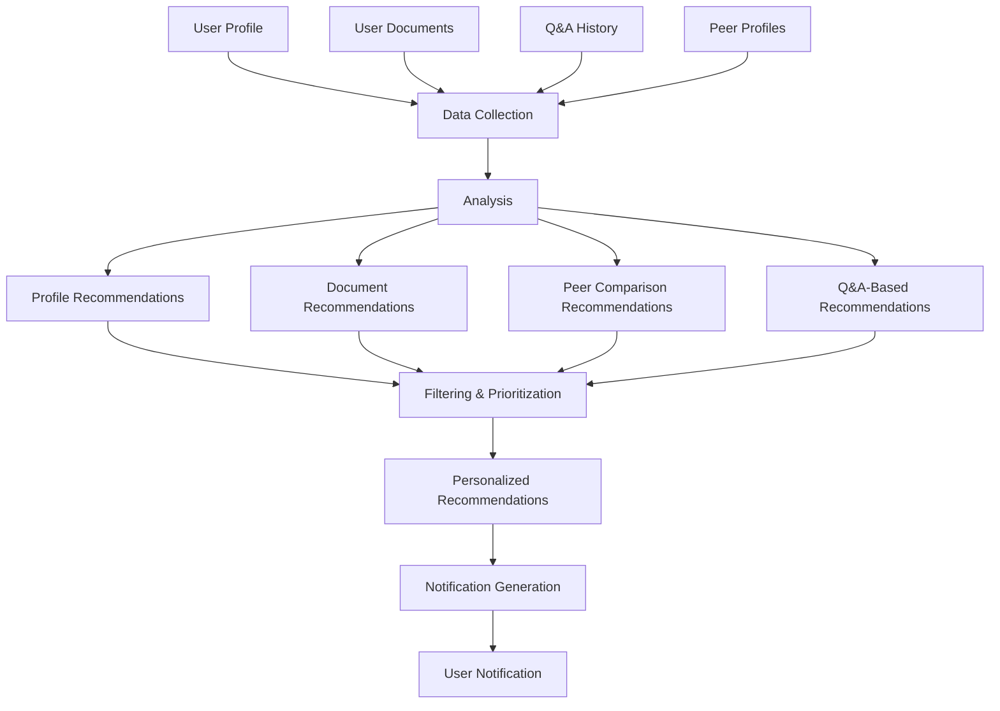
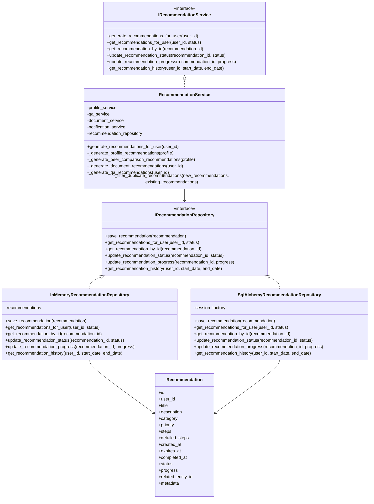
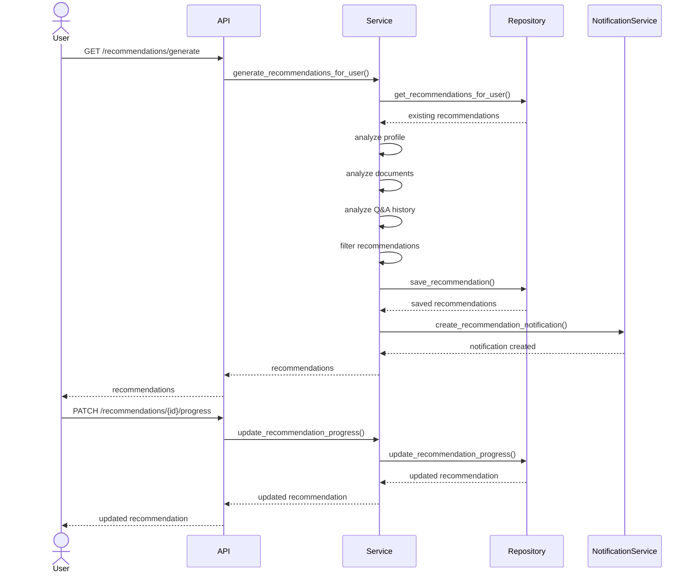
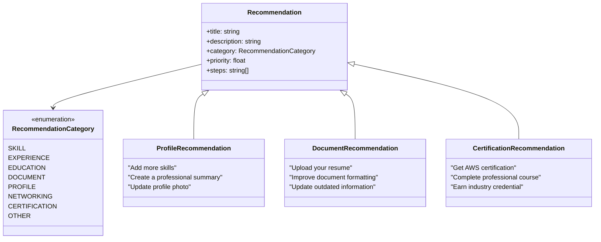

# Recommendation Engine Flow Diagrams

This document contains diagrams illustrating the recommendation generation process and architecture.

## Recommendation Generation Process

## Recommendation Service Architecture

## Recommendation API Flow

## Recommendation Categories and Types

These diagrams illustrate the recommendation engine's architecture, data flow, and component relationships. 