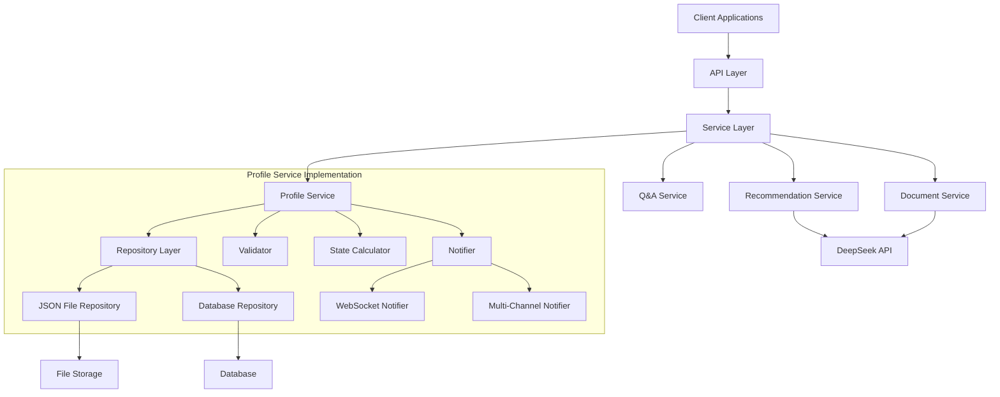

# Student Profiler Backend

This is the backend component of the Student Profiler application. It provides a set of services for managing student profiles, document analysis, and recommendations.

## Architecture Overview

The Student Profiler backend follows a service-oriented architecture based on SOLID principles. It uses a layered approach with clear separation of concerns:



## Major Services

### Profile Service

The Profile Service manages user profiles, allowing for creation, retrieval, update, and deletion of profiles. It supports:

- **Section-based profiles**: Profiles are organized into logical sections (personal, education, experience, etc.)
- **Progressive data collection**: Users can complete profile sections in stages
- **Validation**: Data is validated against configurable rules
- **Real-time notifications**: WebSocket-based notifications for profile updates

**Key Components:**
- `ProfileService`: Main service implementation
- `ProfileRepository`: Storage layer abstraction (JSON file or database implementations)
- `ProfileValidator`: Validates profile data against rules
- `ProfileStateCalculator`: Calculates current profile state
- `ProfileNotifier`: Sends notifications when profiles change

### Document Service

The Document Service handles document processing and extraction:

- Document upload and analysis
- Structured data extraction from resumes, cover letters, etc.
- Document storage and retrieval

### Recommendation Service

The Recommendation Service generates personalized recommendations:

- Profile improvement suggestions
- Profile quality scoring
- Strength and weakness analysis
- Priority-based action items

### QA Service

The QA Service manages interactive profiling questions:

- Generates tailored questions based on profile state
- Evaluates answers and provides feedback
- Scores responses for quality

## Architecture Patterns

The Student Profiler backend implements several architectural patterns:

### 1. SOLID Principles

- **Single Responsibility**: Each class has one focused responsibility
- **Open/Closed**: Components are open for extension, closed for modification
- **Liskov Substitution**: Implementations are substitutable for their interfaces
- **Interface Segregation**: Small, focused interfaces (e.g., separate interfaces for storage, validation)
- **Dependency Inversion**: High-level modules depend on abstractions, not concrete implementations

### 2. Repository Pattern

Data access is abstracted through repository interfaces, allowing multiple storage implementations without changing service code.

### 3. Factory Pattern

Factory classes create and configure service components, centralizing instantiation logic.

### 4. Dependency Injection

Services receive their dependencies through constructor injection, improving testability and flexibility.

### 5. Observer Pattern

The notification system implements the observer pattern to notify subscribers of state changes.

### 6. Strategy Pattern

Different strategies for validation, storage, etc. can be swapped dynamically.

## Configuration System

The Student Profiler backend uses a YAML-based configuration system with environment variable overrides. Configuration settings are centralized in a `config.yaml` file and accessed through a configuration utility module.

## Configuration File Location

The system looks for a `config.yaml` file in the following locations (in order):

1. The backend directory
2. A `config` subdirectory in the backend directory
3. `/etc/profiler/config.yaml`

You can also specify a custom path when initializing the configuration manager.

## Configuration Structure

The configuration file is organized into sections:

- `api`: API server settings
- `services`: External service configurations (e.g., DeepSeek API)
- `database`: Database connection settings
- `logging`: Logging configuration
- `documents`: Document processing settings
- `workflow`: Profile workflow settings
- `websocket`: WebSocket server settings
- `security`: Security-related configurations

See the default `config.yaml` for full details on available settings.

## Environment Variable Overrides

You can override any configuration value using environment variables. The system uses a naming convention:

- Variables must be prefixed with `PROFILER_`
- Use double underscore (`__`) as a separator for nested keys
- Example: `PROFILER_SERVICES__DEEPSEEK__API_KEY=your_api_key`

## Using the Configuration System

### Basic Usage

```python
from profiler.app.backend.utils import get_config, get_deepseek_config

# Get a specific value with a key path
api_port = get_config(["api", "port"], default=8000)

# Get a value using a helper function
deepseek_api_key = get_deepseek_config("api_key")
```

### Available Helper Functions

- `get_config(key_path, default=None)`: Get any config value by path
- `get_api_config(key, default=None)`: Get API settings
- `get_deepseek_config(key, default=None)`: Get DeepSeek API settings
- `get_database_config(key=None, default=None)`: Get database settings
- `get_document_config(key=None, default=None)`: Get document processing settings
- `get_workflow_config(key=None, default=None)`: Get workflow settings
- `get_logging_config()`: Get logging settings
- `get_security_config(key=None, default=None)`: Get security settings
- `get_websocket_config(key=None, default=None)`: Get WebSocket settings

### Advanced Usage

For more advanced use cases, you can use the `ConfigManager` class directly:

```python
from profiler.app.backend.utils import ConfigManager

# Get singleton instance
config = ConfigManager()

# Load with custom path
config.load_config("/path/to/custom/config.yaml")

# Get entire configuration
all_config = config.get_all()

# Set a runtime value (not persisted)
config.set_value(["api", "debug"], True)
```

## Required Configuration Values

The following configuration values are required and will be validated at startup:

- `api.host`
- `api.port`
- `api.api_key`
- `services.deepseek.url`
- `services.deepseek.api_key`

## Example Configuration

```yaml
api:
  host: "0.0.0.0"
  port: 8000
  api_key: "your_api_key"

services:
  deepseek:
    url: "https://api.deepseek.com/v1"
    api_key: "your_deepseek_api_key"
    model: "r1-alpha"
```

## Best Practices

1. Never commit sensitive values (API keys, passwords) to version control
2. Use environment variables for sensitive values in production
3. Create different configurations for development and production environments
4. Use meaningful defaults for optional values 