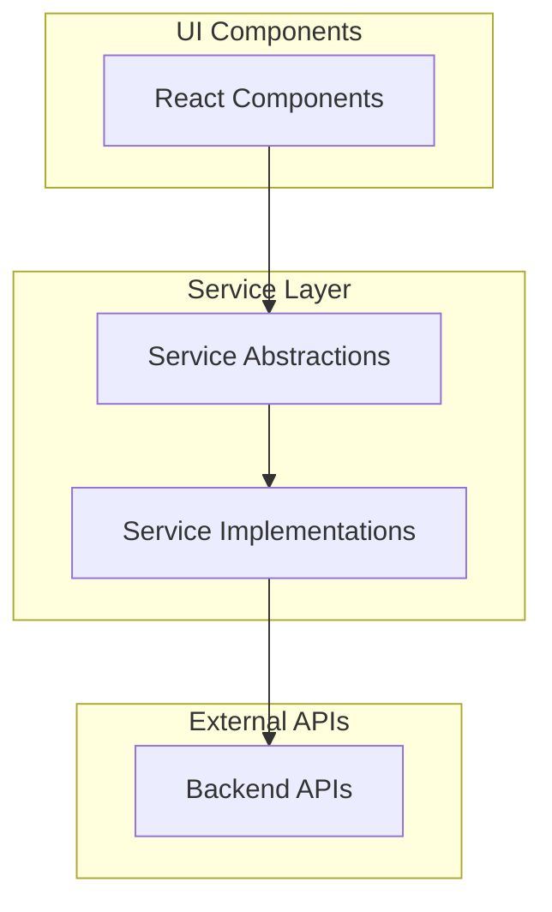

# Profiler UI

The frontend application for the Student Profiler system, built with Next.js and React.

## Architecture

The Profiler UI follows a clean architecture pattern with a clear separation of concerns:



## Core Services

### Profile Service
Responsible for building student profiles through real-time communication with the backend.

**Features:**
- Real-time profile building via WebSocket
- Resilient connection with automatic reconnection
- Connection timeout handling (10 seconds)
- Exponential backoff for reconnection attempts
- Comprehensive error handling
- Message queuing during disconnection

### Document Service
Handles document uploads and analysis.

**Features:**
- Document upload functionality
- Document analysis and extraction
- Progress tracking

### Recommendation Service
Provides personalized recommendations based on profile data.

**Features:**
- College recommendation generation
- Essay topic suggestions
- Application strategy recommendations

## Profile State Structure

```typescript
interface ProfileState {
  sections: {
    [sectionName: string]: {
      status: ProfileStatus;
      data: any;
    }
  };
  status: "active" | "completed" | "error";
  currentQuestion?: string;
  currentSection?: string;
  error?: string;
}
```

## Service Factory

The application uses a Service Factory pattern to provide implementations of the service interfaces:

```typescript
// Service factory implementation
export class ServiceFactory {
  static getProfileService(): ProfileService {
    return new WebSocketProfileService();
  }
  
  static getDocumentService(): DocumentService {
    return new RESTDocumentService();
  }
  
  static getRecommendationService(): RecommendationService {
    return new RESTRecommendationService();
  }
}
```

## Setup and Development

### Prerequisites
- Node.js 18+
- npm or yarn

### Installation
```bash
npm install
```

### Development
```bash
npm run dev
```

### Build
```bash
npm run build
```

### Testing
```bash
npm test
```

## Project Structure

```
app/ui/
├── app/              # Next.js app directory
│   ├── page.tsx      # Home page
│   └── layout.tsx    # Root layout
├── components/       # React components
│   ├── ProfileBuilder/ # Profile building components
│   ├── DocumentUpload/ # Document upload components
│   └── Recommendations/ # Recommendation components
├── lib/              # Core libraries
│   ├── services/     # Service implementations
│   │   ├── types.ts  # Service interfaces
│   │   ├── profile.ts # WebSocket profile service
│   │   ├── document.ts # REST document service
│   │   ├── recommendation.ts # REST recommendation service
│   │   └── factory.ts # Service factory
│   ├── hooks/        # Custom React hooks
│   └── utils/        # Utility functions
├── public/           # Static assets
└── tests/            # Test files
```

## WebSocket Integration

### Establishing a Connection

```typescript
// Creating a WebSocket connection
const connect = async (userId: string): Promise<void> => {
  // Close existing connection if any
  if (this.socket && this.socket.readyState !== WebSocket.CLOSED) {
    this.socket.close();
  }
  
  // Setup connection timeout
  const connectionTimeout = setTimeout(() => {
    if (this.socket && this.socket.readyState !== WebSocket.OPEN) {
      console.error('WebSocket connection timeout');
      this.socket.close();
      this._handleConnectionError(new Error('Connection timeout after 10 seconds'));
    }
  }, 10000); // 10 second timeout

  try {
    const wsUrl = `${process.env.NEXT_PUBLIC_WS_URL}/api/ws/${userId}`;
    this.socket = new WebSocket(wsUrl);
    
    this.socket.onopen = () => {
      clearTimeout(connectionTimeout);
      console.log('WebSocket connection established');
      this.isConnected = true;
      this.reconnectAttempts = 0;
      this._notifyConnectionSuccess();
      
      // Send any queued messages
      while (this.messageQueue.length > 0) {
        const queuedMessage = this.messageQueue.shift();
        if (queuedMessage) this.sendMessage(queuedMessage);
      }
    };
    
    this.socket.onclose = (event) => {
      clearTimeout(connectionTimeout);
      console.log(`WebSocket connection closed: ${event.code} - ${event.reason}`);
      this.isConnected = false;
      this._notifyConnectionClosed();
      
      // Attempt to reconnect with exponential backoff
      if (this.reconnectAttempts < this.maxReconnectAttempts) {
        const delay = Math.min(1000 * Math.pow(2, this.reconnectAttempts), 30000);
        console.log(`Attempting to reconnect in ${delay}ms (attempt ${this.reconnectAttempts + 1})`);
        
        setTimeout(() => {
          this.reconnectAttempts++;
          this.connect(userId);
        }, delay);
      } else {
        console.error('Maximum reconnection attempts reached');
        this._handleConnectionError(new Error('Failed to reconnect after maximum attempts'));
      }
    };
    
    this.socket.onerror = (error) => {
      console.error('WebSocket error:', error);
      this._handleConnectionError(error);
    };
    
    this.socket.onmessage = (event) => {
      try {
        const data = JSON.parse(event.data);
        this._notifyMessageReceived(data);
      } catch (error) {
        console.error('Error parsing WebSocket message:', error);
        this._handleMessageError(error);
      }
    };
  } catch (error) {
    clearTimeout(connectionTimeout);
    console.error('Error creating WebSocket connection:', error);
    this._handleConnectionError(error);
  }
};
```

### Sending Messages

```typescript
// Sending a message through WebSocket
const sendMessage = (message: WebSocketMessage): void => {
  if (!this.socket || this.socket.readyState !== WebSocket.OPEN) {
    console.warn('WebSocket not connected, queueing message');
    this.messageQueue.push(message);
    return;
  }
  
  try {
    this.socket.send(JSON.stringify(message));
  } catch (error) {
    console.error('Error sending message:', error);
    this._handleMessageError(error);
  }
};
```

### Error Handling

```typescript
// Connection error handler
private _handleConnectionError(error: any): void {
  const errorMessage = error instanceof Error ? error.message : 'Unknown connection error';
  console.error(`WebSocket connection error: ${errorMessage}`);
  
  // Notify all error callbacks
  this.errorCallbacks.forEach(callback => {
    try {
      callback({
        type: 'connection',
        message: errorMessage,
        timestamp: new Date().toISOString(),
        error
      });
    } catch (callbackError) {
      console.error('Error in error callback:', callbackError);
    }
  });
}

// Message error handler
private _handleMessageError(error: any): void {
  const errorMessage = error instanceof Error ? error.message : 'Unknown message error';
  console.error(`WebSocket message error: ${errorMessage}`);
  
  // Notify all error callbacks
  this.errorCallbacks.forEach(callback => {
    try {
      callback({
        type: 'message',
        message: errorMessage,
        timestamp: new Date().toISOString(),
        error
      });
    } catch (callbackError) {
      console.error('Error in error callback:', callbackError);
    }
  });
}
```

### Connection State Handling

The WebSocketProfileService includes several methods for handling connection state:

```typescript
// Register a callback for connection success
onConnect(callback: () => void): void {
  this.connectCallbacks.push(callback);
}

// Register a callback for connection close
onDisconnect(callback: () => void): void {
  this.disconnectCallbacks.push(callback);
}

// Register a callback for message reception
onMessage(callback: (data: any) => void): void {
  this.messageCallbacks.push(callback);
}

// Register a callback for error handling
onError(callback: (error: WebSocketError) => void): void {
  this.errorCallbacks.push(callback);
}

// Notify all connection callbacks
private _notifyConnectionSuccess(): void {
  this.connectCallbacks.forEach(callback => {
    try {
      callback();
    } catch (error) {
      console.error('Error in connect callback:', error);
    }
  });
}

// Notify all disconnection callbacks
private _notifyConnectionClosed(): void {
  this.disconnectCallbacks.forEach(callback => {
    try {
      callback();
    } catch (error) {
      console.error('Error in disconnect callback:', error);
    }
  });
}

// Notify all message callbacks
private _notifyMessageReceived(data: any): void {
  this.messageCallbacks.forEach(callback => {
    try {
      callback(data);
    } catch (error) {
      console.error('Error in message callback:', error);
    }
  });
}
```

## Usage Example

```typescript
// In a React component

import { useEffect, useState } from 'react';
import { ServiceFactory } from '../lib/services/factory';
import { ProfileState, WebSocketMessage } from '../lib/services/types';

function ProfileBuilder() {
  const [profileState, setProfileState] = useState<ProfileState | null>(null);
  const [connectionStatus, setConnectionStatus] = useState('disconnected');
  const [error, setError] = useState<string | null>(null);
  
  useEffect(() => {
    const profileService = ServiceFactory.getProfileService();
    
    // Setup connection state handlers
    profileService.onConnect(() => {
      setConnectionStatus('connected');
      setError(null);
    });
    
    profileService.onDisconnect(() => {
      setConnectionStatus('disconnected');
    });
    
    profileService.onMessage((data) => {
      if (data.state) {
        setProfileState(data.state);
      }
    });
    
    profileService.onError((wsError) => {
      setError(`${wsError.type} error: ${wsError.message}`);
    });
    
    // Connect to the WebSocket
    profileService.connect('test-user-1');
    
    // Cleanup on unmount
    return () => {
      profileService.disconnect();
    };
  }, []);
  
  // Function to send a message
  const sendAnswer = (question: string, answer: string) => {
    const profileService = ServiceFactory.getProfileService();
    
    const message: WebSocketMessage = {
      action: 'ANSWER_QUESTION',
      payload: {
        question,
        answer
      }
    };
    
    profileService.sendMessage(message);
  };
  
  // Render component based on state
  return (
    <div>
      <div className="connection-status">
        Status: {connectionStatus}
        {error && <div className="error">{error}</div>}
      </div>
      
      {profileState && (
        <div className="profile-builder">
          <h2>Current Section: {profileState.currentSection}</h2>
          {profileState.currentQuestion && (
            <div className="question-box">
              <h3>{profileState.currentQuestion}</h3>
              <textarea onChange={(e) => /* handle input */} />
              <button onClick={() => sendAnswer(profileState.currentQuestion!, /* get answer */)}>
                Submit
              </button>
            </div>
          )}
        </div>
      )}
    </div>
  );
}

export default ProfileBuilder;
```

## UI Component Guidelines

When creating new UI components that interact with WebSocket services:

1. Use the ServiceFactory to get service instances
2. Handle connection states (connecting, connected, disconnected)
3. Provide appropriate error handling and user feedback
4. Implement reconnection UI for better user experience
5. Consider message queuing for offline capability

## Adding New UI Features

1. Define the component requirements
2. Create the React component in the appropriate directory
3. Implement the necessary service interactions
4. Add tests for the component
5. Update this documentation with any new patterns or APIs 