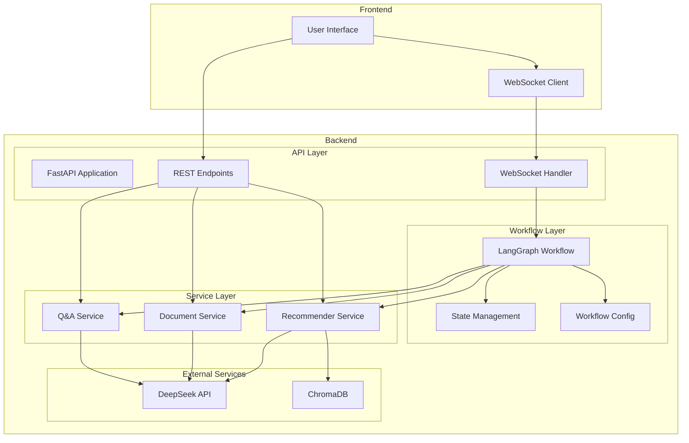

# Student Profiler UI

A Next.js TypeScript UI for the student profiler application, featuring real-time interactions and human-in-the-loop review system.

## Architecture Overview



## Core Services

### 1. Profile Service (`WebSocketProfileService`)
- Handles real-time communication with the backend
- Manages WebSocket connections and message handling
- Features:
  - Automatic reconnection
  - Message queuing
  - Error handling
  - Event callbacks

### 2. Document Service (`RESTDocumentService`)
- Manages document uploads and analysis
- Supports multiple document types:
  - Academic transcripts
  - Essays
  - Resumes
  - Certificates
- Features:
  - Batch processing
  - Content extraction
  - Metadata analysis
  - Error recovery

### 3. Recommendation Service (`RESTRecommendationService`)
- Generates profile recommendations
- Provides profile summaries
- Features:
  - Section-specific recommendations
  - Quality scoring
  - Improvement suggestions
  - Progress tracking

## State Management

### Profile State Structure
```typescript
interface ProfileState {
  user_id: string;
  current_section: ProfileSection;
  current_questions: string[];
  current_answer: string | null;
  sections: {
    academic: ProfileData & { status: ProfileStatus };
    extracurricular: ExtracurricularData & { status: ProfileStatus };
    personal: PersonalData & { status: ProfileStatus };
    essays: EssayData & { status: ProfileStatus };
  };
  context: Record<string, any>;
  review_requests: Array<{
    section: ProfileSection;
    data: any;
    recommendations: any[];
    quality_score: number;
  }>;
  interaction_count: number;
  last_updated: string;
  status: string;
  error: string | null;
  summary: {
    strengths: string[];
    areas_for_improvement: string[];
    unique_selling_points: string[];
    overall_quality: number;
    last_updated: string;
  } | null;
}
```

## Service Factory Pattern

The application uses a singleton Service Factory pattern to manage service instances:

```typescript
class ServiceFactory {
  private static instance: ServiceFactory;
  private profileService: ProfileService | null = null;
  private documentService: DocumentService | null = null;
  private recommendationService: RecommendationService | null = null;

  static getInstance(): ServiceFactory {
    if (!ServiceFactory.instance) {
      ServiceFactory.instance = new ServiceFactory();
    }
    return ServiceFactory.instance;
  }

  getProfileService(): ProfileService { ... }
  getDocumentService(): DocumentService { ... }
  getRecommendationService(): RecommendationService { ... }
}
```

## Features

- **Real-time Profile Building**
  - WebSocket-based communication
  - Instant feedback and updates
  - Progress tracking

- **Document Analysis**
  - Multiple document type support
  - Automated information extraction
  - Quality assessment

- **Human-in-the-loop Review**
  - Section-specific review requests
  - Quality threshold monitoring
  - Feedback integration

- **Profile Organization**
  - Section-based structure
  - Progress tracking
  - Status management

- **Recommendations**
  - Real-time suggestions
  - Quality scoring
  - Improvement tracking

## Prerequisites

- Node.js 18.x or later
- npm or yarn
- Backend server running (see backend README)

## Setup

1. Install dependencies:
```bash
npm install
# or
yarn install
```

2. Create a `.env.local` file with the following variables:
```env
NEXT_PUBLIC_API_URL=http://localhost:8000
NEXT_PUBLIC_WS_URL=ws://localhost:8000
NEXT_PUBLIC_API_KEY=your_api_key_here
```

3. Start the development server:
```bash
npm run dev
# or
yarn dev
```

4. Open [http://localhost:3000](http://localhost:3000) in your browser.

## Project Structure

```
app/
├── components/          # React components
│   └── ProfileBuilder.tsx
├── lib/
│   ├── contexts/       # React contexts
│   │   └── ProfileContext.tsx
│   └── services/       # Service abstractions
│       ├── types.ts
│       ├── profile.ts
│       ├── document.ts
│       ├── recommendation.ts
│       └── index.ts
├── app/                # Next.js app directory
│   ├── page.tsx
│   ├── layout.tsx
│   └── globals.css
└── public/            # Static assets
```

## Development

- `npm run dev`: Start development server
- `npm run build`: Build for production
- `npm run start`: Start production server
- `npm run lint`: Run ESLint

## Contributing

1. Fork the repository
2. Create your feature branch
3. Commit your changes
4. Push to the branch
5. Create a new Pull Request

## License

MIT 