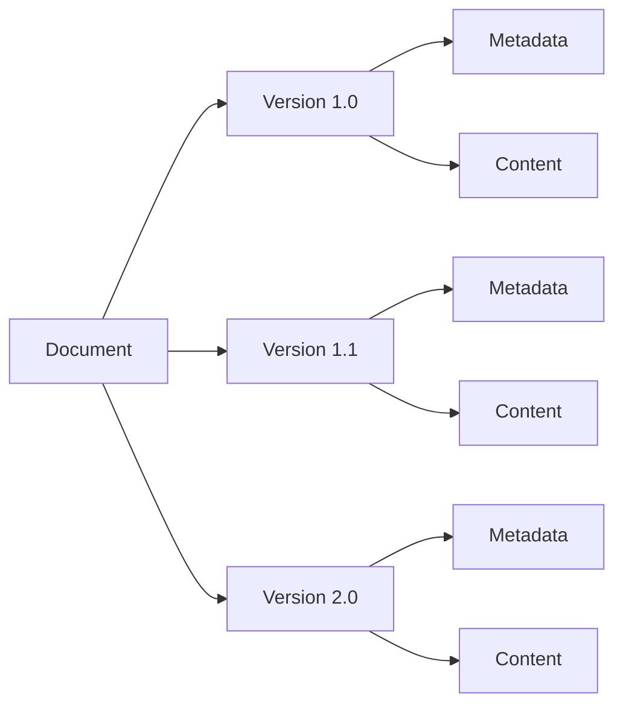

# Document Lifecycle and Versioning

## Document Lifecycle

### 1. Creation
- Document upload initiation
- Metadata extraction
- Content processing (OCR, indexing)
- Initial version creation
- Access control setup

### 2. Storage
- Primary storage in PostgreSQL
- File storage in filesystem
- CDN distribution
- Backup creation

### 3. Access & Usage
- Access control enforcement
- Document retrieval
- Version history access
- Audit logging

### 4. Updates & Versioning
- Version creation on changes
- Change tracking
- Version metadata
- Rollback capability

### 5. Archival & Deletion
- Archival policies
- Retention periods
- Secure deletion
- Audit trail preservation

## Versioning System

### Version Structure


### Version Metadata
- Version number
- Creation timestamp
- Author information
- Change description
- Checksum
- File size

### Version Control Operations
1. **Create Version**
   - Document modification
   - Version increment
   - Metadata update
   - Content storage

2. **Access Version**
   - Version selection
   - Access control check
   - Content retrieval
   - Audit logging

3. **Compare Versions**
   - Version selection
   - Content comparison
   - Metadata comparison
   - Change highlighting

4. **Rollback**
   - Version selection
   - Content restoration
   - Metadata update
   - New version creation

## Implementation Details

### Database Schema
```sql
CREATE TABLE document_versions (
    version_id UUID PRIMARY KEY,
    document_id UUID REFERENCES documents(id),
    version_number VARCHAR(20),
    created_at TIMESTAMP,
    created_by UUID,
    change_description TEXT,
    content_checksum VARCHAR(64),
    file_size BIGINT,
    storage_path VARCHAR(255)
);
```

### API Endpoints
- `POST /api/documents/{id}/versions` - Create new version
- `GET /api/documents/{id}/versions` - List versions
- `GET /api/documents/{id}/versions/{version}` - Get specific version
- `POST /api/documents/{id}/versions/{version}/rollback` - Rollback to version

### Security Considerations
- Version access control
- Version deletion restrictions
- Audit logging for version operations
- Data integrity verification

### Performance Optimization
- Version content storage optimization
- Version metadata indexing
- Caching strategy
- Query optimization 