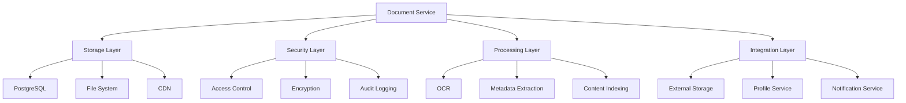

# Document Management Architecture

## Overview
The document management system is built on a microservices architecture with the following key components:

### Core Components
1. **Document Service**
   - Handles document storage, retrieval, and versioning
   - Implements document metadata extraction and processing
   - Manages document security and access control

2. **Storage Layer**
   - PostgreSQL for metadata and document references
   - File system for document storage
   - CDN for efficient document delivery

3. **Security Layer**
   - Document-level access control
   - Encryption for sensitive documents
   - Audit logging for all operations

### Key Features
1. **Document Storage & Retrieval**
   - Chunked uploads for large files
   - Version control system
   - Efficient document retrieval

2. **Security & Access Control**
   - Role-based access control
   - Document encryption
   - Audit logging
   - Watermarking capabilities

3. **Document Processing**
   - OCR for scanned documents
   - Metadata extraction
   - Content indexing
   - Virus scanning

4. **Integration**
   - External storage services (Google Drive, Dropbox)
   - Profile linking
   - Notification system

## Architecture Diagram

## Data Flow
1. **Document Upload**
   - Client initiates upload
   - Document is processed (virus scan, metadata extraction)
   - Document is stored with metadata
   - Access control is applied
   - Audit log entry is created

2. **Document Retrieval**
   - Access control check
   - Document retrieval from storage
   - Audit log entry
   - Delivery to client

3. **Document Processing**
   - Scheduled processing tasks
   - Background OCR and indexing
   - Metadata updates
   - Notification generation

## Security Considerations
1. **Access Control**
   - Role-based permissions
   - Document-level access control
   - Sharing controls

2. **Data Protection**
   - Encryption at rest
   - Secure transmission
   - Regular backups

3. **Audit & Compliance**
   - Comprehensive logging
   - Audit trails
   - Compliance reporting

## Scalability
1. **Horizontal Scaling**
   - Service replication
   - Load balancing
   - CDN integration

2. **Performance Optimization**
   - Caching strategy
   - Index optimization
   - Query optimization

3. **Storage Management**
   - Storage tiering
   - Archival policies
   - Cleanup procedures 